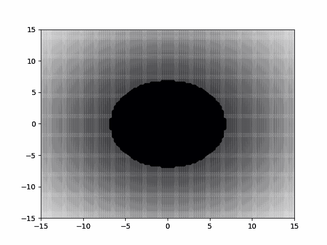
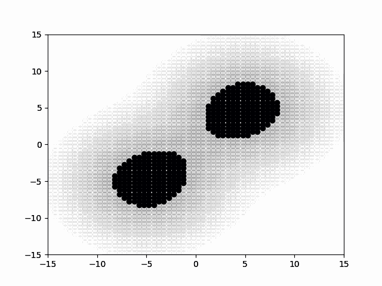

# STARFORUBC: Modelling Gravitating Fluids in 2D

McGill Physics Hackathon 2021\
Devpost: https://devpost.com/software/modelling-gravitating-fluids-in-2d?ref_content=user-portfolio&ref_feature=in_progress 

The code makes use of a 2D poisson equation solver to find the gravitational field from our density field. It also implements the ideal hydrodynamic equations to calculate the change in energy, density, and velocity while maintaining conservation laws. With more time and effort, the project can be extended to larger scales and can observe potentially interesting initial conditions. It can also be extended into 3D and be edited to make use of magnetohydrodynamics.

2d poisson solver: https://github.com/zaman13/Poisson-solver-2D

 \

